# JAVASCRIPT

Notes de cours provisoires

Basées notamment sur :

- Le tutoriel d'Openclassroom "Apprenez à coder avec JavaScript" (20 heures, facile) : https://openclassrooms.com/fr/courses/2984401-apprenez-a-coder-avec-javascript, en grande partie ;
- Le livre « Javascript pour les Web Designers » de Mat Marquis, Collection A Book Apart n° 20 aux Éditions Eyrolles, dans une moindre mesure.

# Partie 2 - Évoluer vers des programmes plus complexes

## 5. Modularisez votre code grâce aux fonctions

Dans ce chapitre, vous allez découvrir comment décomposer un programme en sous-parties appelées des fonctions.

### Introduction : le rôle des fonctions

Jusqu'à présent, vos programmes étaient écrits sur le modèle du premier algorithme : des actions individuelles qui s'enchaînent.

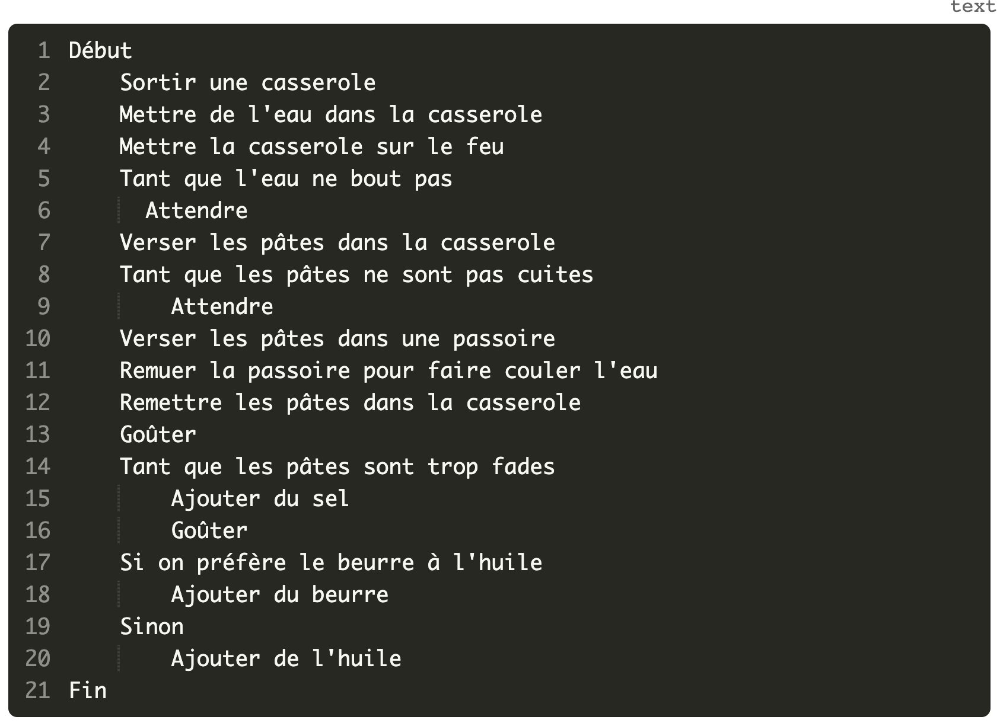

On va maintenant apprendre à les concevoir sous la forme d'un ensemble de sous-étapes.

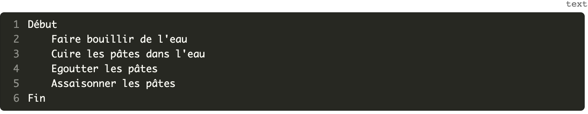

En JavaScript, ces sous-étapes sont appelées des fonctions.

### Découverte des fonctions

Une fonction est un regroupement d'instructions qui réalise une tâche donnée.

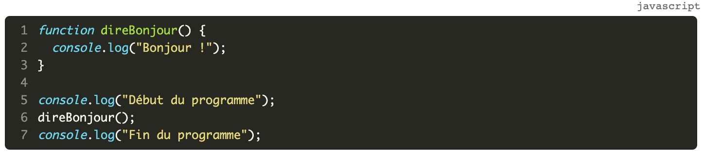

#### Déclaration d'une fonction

La déclaration de fonction permet de créer une fonction et de lui associer un nom.

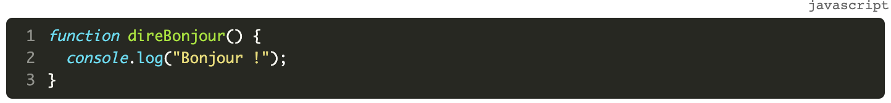

La déclaration d'une fonction s'effectue à l'aide du mot-clé `function` suivi du nom de la fonction et d'une paire de parenthèses. Les instructions qui composent la fonction constituent le **corps** de la fonction. Ces instructions sont placées entre accolades et indentées.

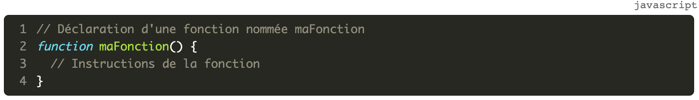

#### Appel d'une fonction

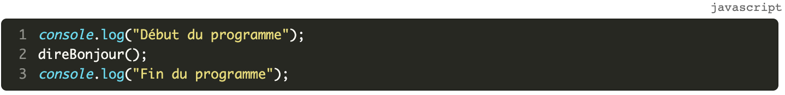 

L'appel d'une fonction s'effectue en écrivant le nom de la fonction suivi d'une paire de parenthèses. 

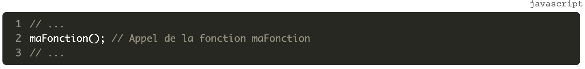 

L'appel d'une fonction déclenche l'exécution des instructions qui la constituent, puis l'exécution du code reprend à l'endroit où la fonction a été appelée. 

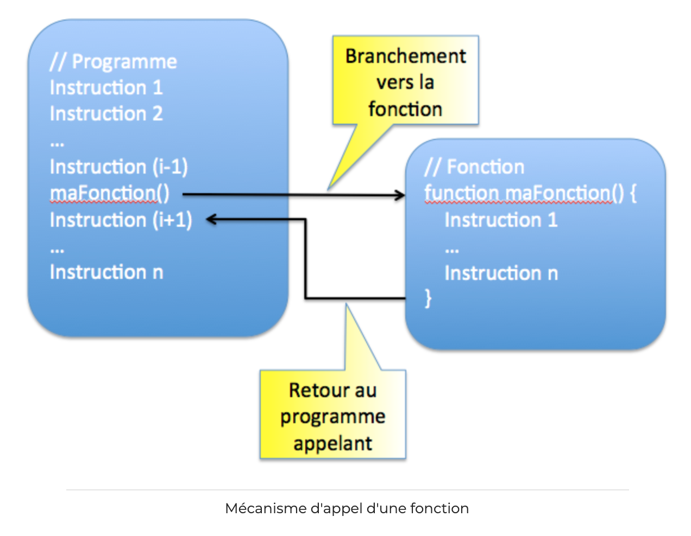

#### Avantages des fonctions

Lorsqu'on cherche à résoudre un problème complexe, il est généralement efficace de le décomposer en sous-problèmes plus simples.

Les fonctions permettent d'appliquer ce principe à la création de logiciels : on va décomposer le programme en écrivant plusieurs fonctions, chacune dédiée à un objectif particulier. Le programme fera appel aux fonctions au fur et à mesure de son exécution.

Ecrit sous la forme d'une combinaison de fonctions, le programme sera plus lisible et plus facile à faire évoluer qu'un programme écrit de manière monobloc. De plus, il sera parfois possible de réutiliser certaines fonctions dans d'autres programmes.

Enfin, la création d'une fonction permet de lutter contre la duplication de code : plutôt que de dupliquer le même code dans un programme, on centralise ce code sous la forme d'une fonction et on y fait appel depuis tous les endroits où c'est nécessaire.

Écrire un programme sous forme d'un ensemble de fonctions plutôt qu'en un seul bloc permet donc de gagner en lisibilité et en modularité.

### Possibilités des fonctions

#### Valeur de retour : le mot-clé return

Une fonction peut renvoyer une valeur grâce au mot-clé  return  , ou ne rien renvoyer (on parle alors de procédure). 

Si on essaie de récupérer la valeur de retour d'une fonction qui n'inclut pas d'instruction `return`, on obtient la valeur JavaScript `undefined`.

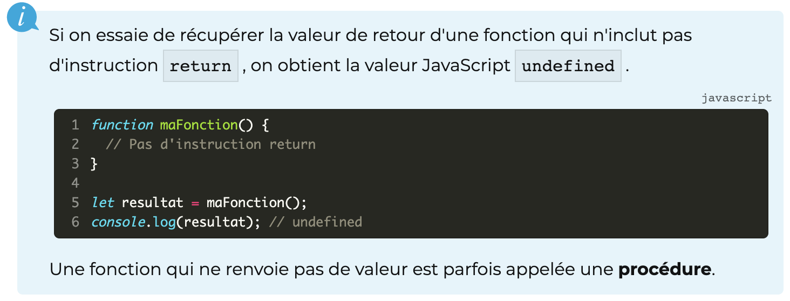

L'utilisation du mot-clé `return` dans une fonction permet de lui donner une valeur de retour. Son appel produit un résultat qui correspond à la valeur placée juste après lereturn dans la fonction. Ce résultat peut être récupéré par le programme appelant. Ici, la fonction `direBonjour()` renvoie la valeur chaîne `"Bonjour !"`. Cette valeur est stockée par le programme dans la variable resultat, qui est ensuite affichée.

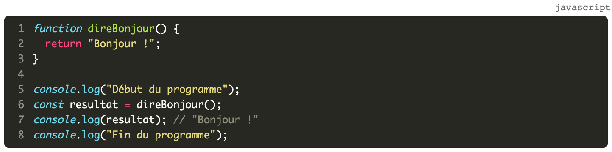 

Une fonction incluant une instruction `return` renvoie une valeur de retour lorsqu'elle est appelée : cette valeur résulte de l'évaluation de l'expression située immédiatement après le `return`.

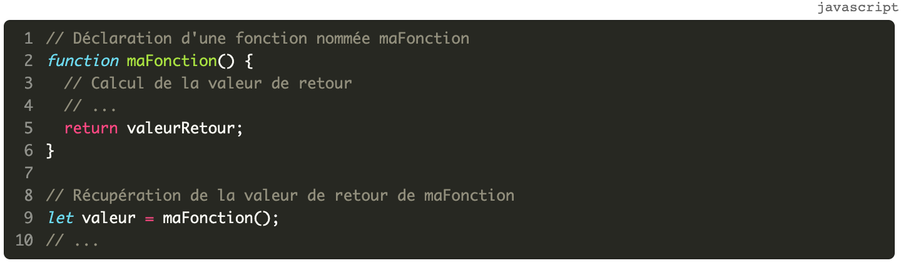  

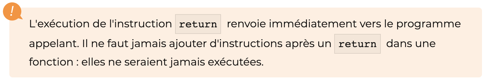   

#### Variables locales

Les variables déclarées dans le corps d'une fonction sont appelées des variables locales. Leur portée se limite au corps de la fonction.

#### Passage de paramètre

Une fonction peut également accepter ou non des paramètres, qui sont les données dont elle a besoin pour fonctionner.

### Fonctions anonymes

Il existe d'autres manières de créer des fonctions en JavaScript.

Une autre possibilité est d'utiliser une **expression de fonction**. Cette expression peut être affectée à une variable car en JavaScript, la valeur d'une variable peut être une fonction. Les expressions de fonction sont souvent utilisées pour créer des fonctions anonymes.

La fonction créée ci-dessus est anonyme et directement affectée à la variable  bonjour. La valeur de cette variable est donc une fonction. Cette manière de créer une fonction est appelée expression de fonction.

IMG

Depuis ES6, JavaScript offre une syntaxe plus concise pour créer des fonctions anonymes : la fonction fléchée (fat arrow function) :

Il est important de créer des fonctions ayant un rôle bien défini et de limiter leur complexité. Le nom de la fonction, souvent basé sur un verbe à l'infinitif exprimant une action, doit refléter son rôle. JavaScript offre de nombreuses fonctions prédéfinies qui peuvent simplifier la tâche du programmeur.

### Comment (bien) programmer avec les fonctions

